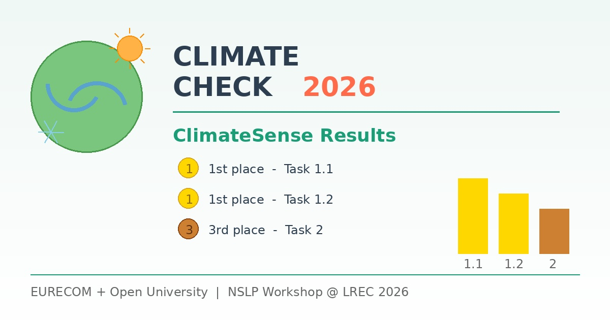

{fig-alt="ClimateCheck 2026" width="100%"}

The ClimateSense project has once again demonstrated its strength in climate misinformation detection. A joint team from EURECOM and the Open University participated in the [ClimateCheck shared task](https://nfdi4ds.github.io/nslp2026/docs/climatecheck_shared_task.html), organised by the NSLP workshop co-located with LREC 2026, and achieved outstanding results:

- **1st place** on Task 1.1
- **1st place** on Task 1.2
- **3rd place** on Task 2

This work was led by Gregoire Burel and Thibault Ehrhart, building on the project's growing expertise in combining large language models with established machine learning techniques for detecting climate-related misinformation.

The code developed for this shared task is openly available on [GitHub](https://github.com/climatesense-project/climatecheck2026). A paper describing the team's approach has been submitted and is currently under review.

These results follow the team's earlier successes at international evaluation campaigns, further strengthening ClimateSense's position at the forefront of research in automated climate misinformation detection.