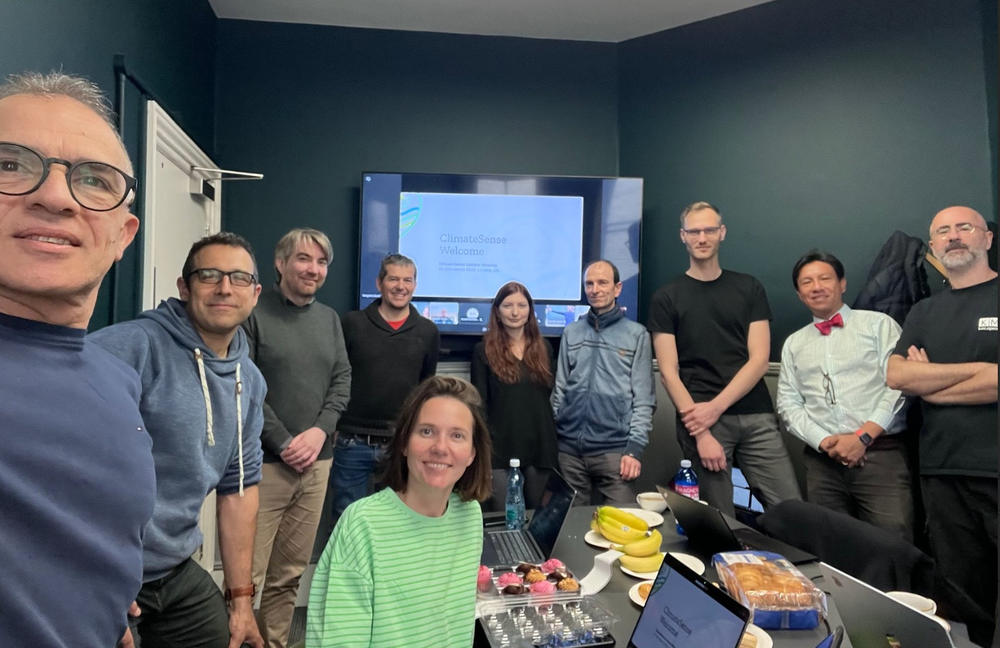

{fig-alt="ClimateSense London meeting March 2026" width="100%"}

On 12-13 March 2026, the ClimateSense consortium gathered in London for its latest project meeting, hosted by the Open University. Partners from all four institutions (OU, EURECOM, KTU, and VSE) participated both in person and remotely.

Over two days, the team reviewed progress across all work packages, covering topics including the development of the project's knowledge graph, advances in geospatial analysis of climate misinformation, progress on the GIS platform demonstrator, and ongoing stakeholder engagement activities.

The meeting also included several collaborative working sessions. Partners discussed strategies for improving data integration across work packages, explored new directions for the project's web-based demonstrator, and conducted hands-on annotation exercises using climate misinformation datasets.

Looking ahead, the team agreed on priorities for the next phase of the project, including publication plans, upcoming deliverables, and preparations for the midterm review. The next consortium meeting is planned for autumn 2026.
