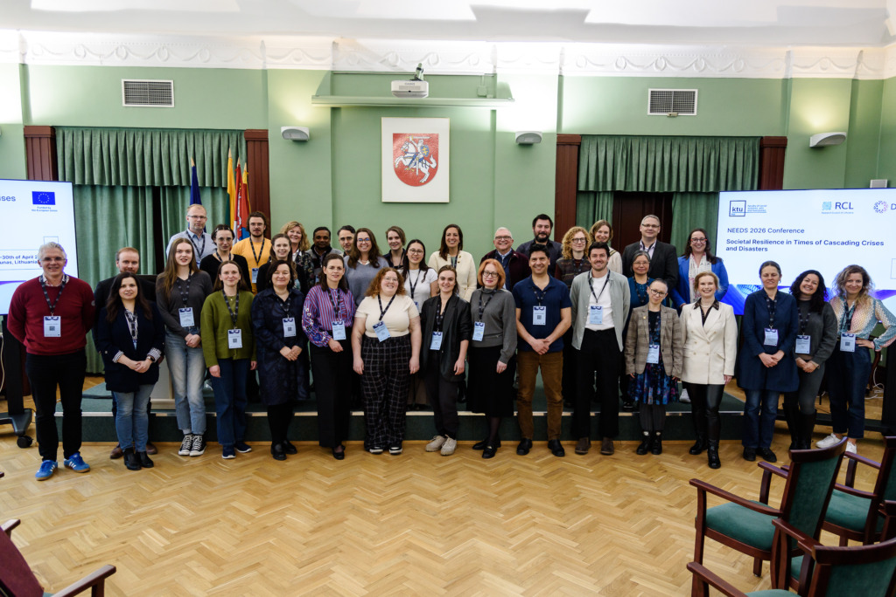

{fig-alt="Group photo of participants at the NEEDS 2026 conference in Kaunas, Lithuania" width="100%"}

The NEEDS 2026 conference, *Societal Resilience in Times of Cascading Crises and Disasters*, took place on 28--30 April 2026 in Kaunas, Lithuania, hosted by Kaunas University of Technology (KTU). The conference brought together researchers, practitioners, and policymakers from across Europe and beyond to discuss disaster resilience, crisis governance, and community preparedness.

KTU team members contributed to the conference in several roles. Monika Maciuliene presented ClimateSense-related research in the session on Technological Innovation for DRR, with a paper titled *Mapping Resilience Gaps in Cascading Crises: Climate Misinformation Platforms as Socio-Technical Infrastructures*. The presentation drew on a systematic mapping of 104 platforms and tools addressing climate misinformation, examining how digital infrastructure shapes resilience outcomes in interconnected crisis settings. The research was funded through the CHIST-ERA grant supporting ClimateSense.

Several other KTU colleagues contributed as session chairs and presenters across the three-day programme, covering topics from socio-economic vulnerability analysis and crisis governance to public trust and community resilience.
