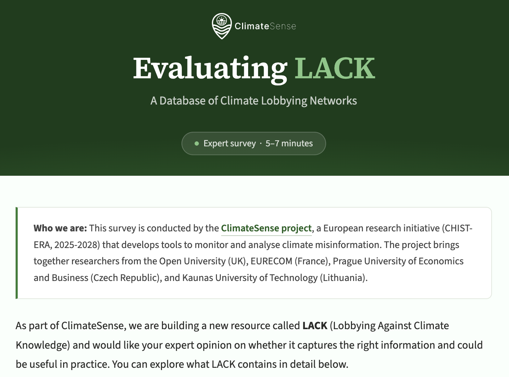

{width="100%"}

As part of Work Package 1 (Requirements, stakeholder engagement and evaluation), the ClimateSense team is conducting an expert evaluation of the [LACK knowledge graph](https://climatesense-project.eu/lack/) -- a structured, searchable database that maps the actors and networks involved in climate lobbying.

LACK integrates data from multiple investigative sources, including the DeSmog Climate Disinformation Database and InfluenceMap's LobbyMap, into a single queryable resource. To ensure the database meets the needs of its intended users, we are gathering expert feedback through a short online survey (5-7 minutes).

We are looking for input from researchers, investigative journalists, fact-checkers, NGO and advocacy professionals, policy analysts, and others who work with information about climate lobbying or climate disinformation. The survey covers topics such as which types of connections matter most for understanding lobbying networks, what use cases a resource like LACK could support, and what data gaps should be prioritised.

If this describes your work, or if you know someone it might be relevant for, please visit the [survey introduction page](https://climatesense-project.eu/survey/) for full details and a link to participate.

For questions about the survey, please contact [monika.maciuliene@gmail.com](mailto:monika.maciuliene@gmail.com).
