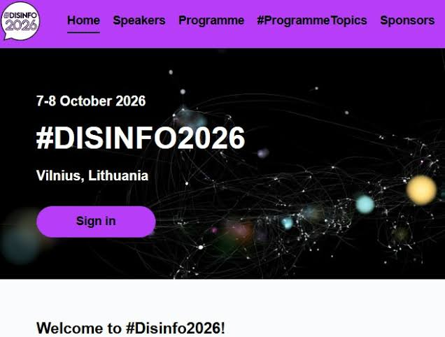

{fig-alt="#Disinfo2026 conference banner, 7-8 October 2026, Vilnius, Lithuania" width="100%"}

The ClimateSense team will attend #Disinfo2026, the annual conference of EU DisinfoLab. It takes place on 7-8 October 2026 at the Radisson Blu Lietuva in Vilnius, Lithuania. Pre-conference workshops run on 6 October.

The conference brings together researchers, journalists, NGOs, public authorities and tech professionals who work against disinformation. This year's programme covers AI and disinformation, platform accountability and enforcement, and joint responses across the community. The event is fully booked.

For ClimateSense, the conference is a chance to meet the people our tools are built for. Over the two days we will talk with participants about climate misinformation, show ClimateSense tools and collect their reactions. We also plan follow-up interviews with interested participants. This input feeds into Work Package 1 (Requirements, stakeholder engagement and evaluation).

Attending #Disinfo2026 and working on climate information? We would be glad to meet you there. Contact [monika.maciuliene@gmail.com](mailto:monika.maciuliene@gmail.com).

More about the conference: [EU DisinfoLab](https://www.disinfo.eu).

*Image: EU DisinfoLab.*
