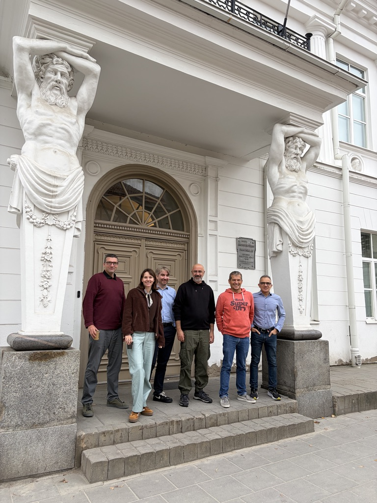

{fig-alt="Six members of the ClimateSense team standing on the steps of a building entrance in Vilnius, October 2026" fig-align="center" width="520"}

On 5-6 October 2026, the ClimateSense consortium met in Vilnius, Lithuania, for its autumn project meeting. The meeting took place at VILNIUS TECH and brought together partners from all four institutions (OU, EURECOM, KTU and VSE).

On the first day, each partner presented progress in its work packages, plans for the next three months and upcoming publications.

The second day was organised as small working sessions. The team worked on the project's knowledge graph, the [LACK](https://climatesense-project.eu/lack/) database of climate lobbying networks, the geolocation of climate claims and the map-based demonstrator.

The team also prepared for [#Disinfo2026](../01/disinfo2026-conference.qmd), the annual conference of EU DisinfoLab, which takes place in Vilnius on 7-8 October, right after the meeting. At the conference, ClimateSense talks with practitioners about climate misinformation and invites them to [online sessions in November](../07/climatesense-sessions.qmd).

The meeting closed with a wrap-up of the working sessions and agreement on next steps.
